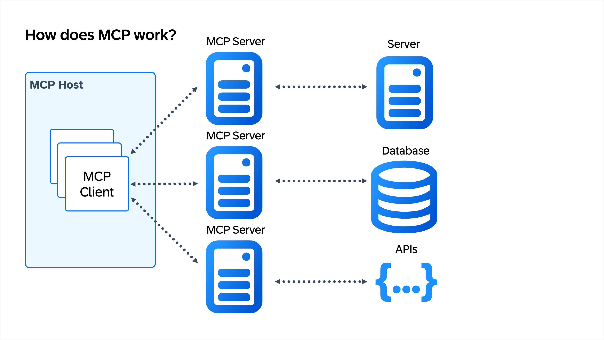
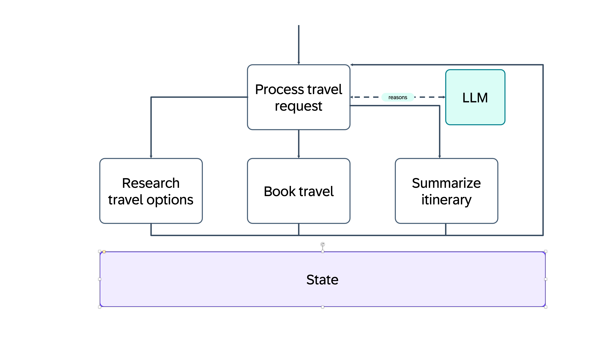

Artificial Intelligence is such a vast and huge beast with switching hype topics every couple of months. For someone who is coming into this world it can be overwhelming and discouraging. If you feel like this, don't worry, you are not alone. I do feel the same way every now and then. This feeling came to me just recently when I wanted to build a new workshop around AI Agents and Agent orchestration. Let's dive into some of my findings from my research.

## Where the heck do I get started?

TL;DR

I wrote my first agent with LangGraph, and you might ask why - Simply! It was the only one I was familiar with. Of course I've heard about many other frameworks out there but I stuck to what I worked with in the past. This is absolutely fine but probably not sufficient going forward with AI development.

The first challenge is understanding what's out there. There are so many different frameworks from different companies, each framework seems to be the best solution for building intelligent agents. Some of these examples are LangGraph, AutoGen, CrewAI, Google ADK, Semantic Kernel, and many more.

For me I wanted to understand what the strengths, weaknesses, and use cases are around these frameworks. Asking the right questions should help narrow your options. Do you want to build a single autonomous agent that needs to reason through tasks? Do you need multiple specialized agents collaborating on a problem? Are you working within a set ecosystem like Microsoft, Google Cloud or AWS? What programming language do you want to use for your agents?

## What are AI agents?

Before we dive into the different frameworks and their specifics, let's talk about what an AI agent is. The basic idea behind an agent is that it is a piece of software allowing an LLM to use different types of tools. LLMs are amazing in understanding natural language and producing natural language to react on given input prompts. If you look at LLMs, they are the brain of the operation but we need a body to do the hard labor. This is where agents come into play. Agents allow the LLM to access different resources and tools to execute tasks, gather information or trigger other agents to do some work with so called agent workflows.

The LLMs can directly interact with an agent or multiple agents if they are known to the LLM. You can make agents known to an LLM through different types of tools like an agent supported client or a cloud landscape which interfaces with the LLM. With agents, LLMs can now control an application workflows. Agents might need to call certain tools, gather resources or use different prompts based on the state. That is why we need frameworks to build this orchestration properly under a human-controlled environment.

The agents can then access different tools, resources or other agents to complete their task. In the past this step could be cumbersome because there was no standard interfacing protocol defining on how an agent would interact with the before-mentioned parts. To solve this, Anthropic created a protocol which should standardize the interfaces. The Model-Context-Protocol (MCP) was born.

MCP gives you a highly standardized protocol that allows you to create a clear interface implementation giving the agents a set of functions to interact with. Because this protocol is standardized and highly adapted by the industry there is a vast amount of MCP Servers (the implementation of the protocol) out there, ready to be consumed by your army of agents.

The diagram below gives a high-level overview on how MCP works:

## What are the core capabilities of an agent framework

Before we dive into specifics of each framework, let's establish a common understanding on what the key capabilities are of such a framework.

The essence of every agent frameworks are:

**1. Tool/Function/Resource calling**: The ability for agents to interact with external systems, APIs, databases and other resources.
**2. State & Memory Management**: Keep track of conversation history, intermediate/final results, and context across multiple steps. Especially important for complex agent workflows.
**3. Orchestration**: Providing a framework to coordinate the flow of tasks, whether it is multiple agents working together or if it is a single agent's reasoning loop.

Every framework we'll discuss implements these capabilities differently, and understanding these differences is the key to choosing the right tool for your project.

## Comparing major agent frameworks

### LangGraph

[LangGraph](https://www.langchain.com/langgraph) is being developed by the LangChain team. It is designed for building stateful, multi-agent applications. LangGraph provides you with a low-level orchestration framework and runtime. It's main purpose is agent orchestration and so allows you to manage and deploy stateful agents. LangGraph is an MIT-licensed open-source library and it is free to use.

LangGraph is designed for complex and enterprise-ready use cases. Through it's low-level APIs, you have full control over the orchestration process.

As the name suggests, LangGraph orchestrates agents via a graph. The nodes can be agents or tools and the edges define their communication route.

Let's take a look at an example to better understand what that means:

We assume we want to build an AI application that can research, book, and build an itinerary summarization for a business trip.

We define a new process that should process incoming travel requests. That process has three actions available: `Research`, `Book`, and `Summarize`.

Each of these actions are defined as nodes. Behind each of these actions can be an agent performing the action. All nodes have access to the application's state, they can read and write into that state. The initial node that triggers the process uses an LLM to reason which node should be contacted. The lines inbetween are called edges and they define the communication between the nodes. As you can see, the state is global within that process, and available to all nodes.

Before we continue to the other frameworks, let's talk quickly about the difference between LangGraph and LangChain.

LangGraph is a framework build on top of LangChain. LangChain provides a broad array of APIs for working with LLMs. It provides you with tools, chains, memory management APIs, and capabilities of building agents. LangGraph comes into play to connect these tools with each other. It helps you to manage and orchestrate all the moving pieces, and it allows for building a multi-agent flow.

**Progamming Language support**: Python + JavaScript/TypeScript

Summary:

- LangGraph provides low-level APIs to orchestrate and manage stateful multi-agent workflows.
- It provides ways of managing memory
- MIT licensed and open-source
- Fit for complex and enterprise scale AI applications

## CrewAI

## Wrapping up

What a post!

## Footnotes

1. Do you like footnotes?
1. Everybody does, fool!
